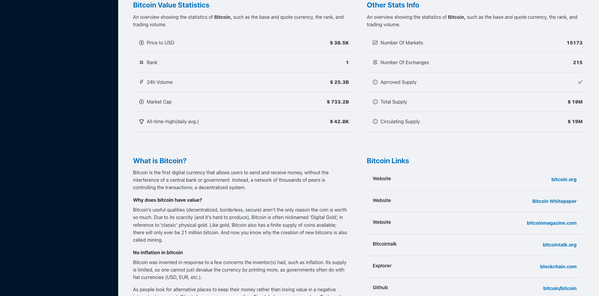
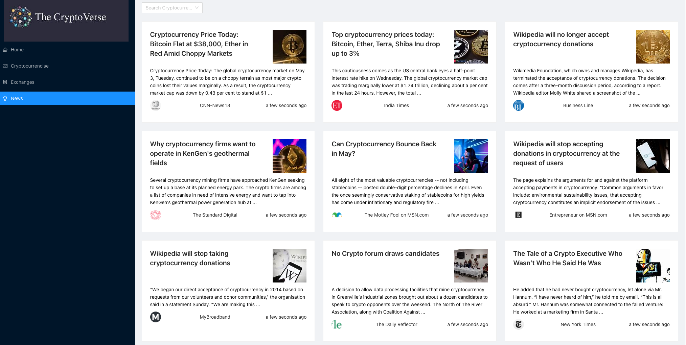

<p>&nbsp;</p>

# The Cryptoverse 🔥

# This is a cryptoverse App that was built using CryptAPIs and is a PWA web app! 🔥

### For clone this repository in your pc pest below link in your terminal 👇

```
git clone https://github.com/Milan-960/The-Cryptoverse-App.git
```

```
npm install
```

```
npm start
```

```@github/clipboard-copy-element
REACT_APP_RAPIDAPI_KEY = "YOUR RapidAPI KEY"
REACT_APP_CRYPTO_API_URL = "YYOUR CRYPTO API URL"
REACT_APP_CRYPTO_RAPIDAPI_HOST = "YOUR CRYPTO RAPIDAPI HOST URL"
REACT_APP_NEWS_API_URL = 'YOUR NEWS API URL'
REACT_APP_NEWS_RAPIDAPI_HOST = "YOUR RAPIDAPI HOST URL"

ESLINT_NO_DEV_ERRORS = true
```

<h1>Home Page</h1>

<p>&nbsp;</p>

<h1>Info Page</h1>

<p>&nbsp;</p>

<h1>News Page</h1>

<p>&nbsp;</p>
